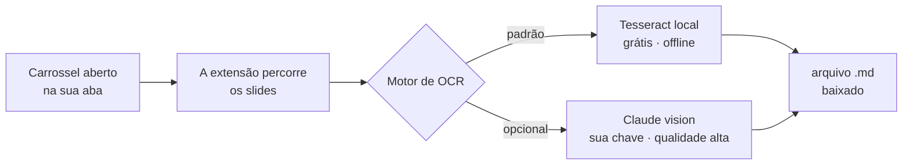

# mscreative-plugins

**Plugins de navegador da MSCREATIVE.SYSTEMS™. Open-source, em português, rodando local — cada um resolve uma dor concreta de quem trabalha com conteúdo.**

[Instalar](#instalar) • [Plugins](#plugins-disponíveis) • [FAQ](#faq) • [Sobre](#sobre)

---

O primeiro plugin transcreve um carrossel inteiro do Instagram — os 15 slides de uma vez — num único arquivo `.md`. Sem copiar e colar slide a slide. Tudo no seu navegador, sem servidor.

**Pra quem é:** quem produz, estuda ou faz engenharia reversa de conteúdo no Instagram e precisa do texto dos carrosséis fora do app — criadores, social media, pesquisadores, gente montando swipe file.

## Plugins disponíveis

| Plugin | Versão | O que faz | Tipo |
|---|---|---|---|
| [`instagram-carousel-transcriber`](./plugins/instagram-carousel-transcriber/) | v0.2.0 | Lê todos os slides de um carrossel do Instagram e baixa um `.md` com o texto de cada slide + a legenda. OCR local grátis por padrão; modo Claude opcional pra qualidade alta. | Extensão Chrome (MV3) |

## Como funciona



## Instalar

Cada plugin tem o próprio README com o passo a passo. O caminho comum, pra extensões Chrome em modo desenvolvedor:

```bash
git clone https://github.com/1marcelserrano/mscreative-plugins.git
# depois: chrome://extensions → Modo do desenvolvedor → Carregar sem compactação → plugins/<nome>/
```

1. Clone o repo (ou baixe o ZIP).
2. Entre na pasta do plugin (ex.: `plugins/instagram-carousel-transcriber/`) e siga o README dele — alguns precisam de um passo de `FETCH.sh` pra baixar binários que ficam embarcados.
3. Abra `chrome://extensions`, ligue o **Modo do desenvolvedor**, clique em **Carregar sem compactação** e aponte pra pasta do plugin.

Atualize com `git pull` — o [CHANGELOG](./CHANGELOG.md) registra o que muda a cada versão.

## Plugins em detalhe

### `instagram-carousel-transcriber`

Extensão Chrome (Manifest V3, MIT) que percorre um carrossel aberto na sua aba logada, lê o texto de cada slide e baixa um `.md` com slide a slide + a legenda original.

- **Padrão: OCR 100% local** com [Tesseract.js](https://tesseract.projectnaptha.com/) (`por+eng`). Nenhuma imagem sai da máquina. Sem API paga, sem backend.
- **Modo Claude (opcional):** liga a visão do [Claude](https://www.anthropic.com/claude) com a sua própria chave pra ler texto estilizado e fotos muito melhor. ~US$ 0,03 por carrossel no Haiku. Como ligar, custo e privacidade: [README do plugin](./plugins/instagram-carousel-transcriber/#modo-claude-opcional).
- Pasta auto-contida, pronta pra listagem na Chrome Web Store.

## FAQ

**Meus dados ficam seguros?**
No modo padrão (Tesseract), sim: tudo roda no seu navegador, nada sai da máquina, sem analytics, sem servidor. No modo Claude (opcional, que você liga de propósito), cada slide é enviado pra API da Anthropic com a sua chave — detalhado em [PRIVACY.md](./plugins/instagram-carousel-transcriber/PRIVACY.md).

**Como desinstalo?**
`chrome://extensions` → Remover. Não sobra nada: a extensão não grava dados fora do navegador.

**Funciona em qual navegador?**
Chrome e navegadores baseados em Chromium (Edge, Brave, Arc), no desktop. É Manifest V3.

**Isso é mantido?**
Sim. Mudanças entram no [CHANGELOG](./CHANGELOG.md); atualize com `git pull`. Bug ou seletor do Instagram quebrado? Abra uma [issue](https://github.com/1marcelserrano/mscreative-plugins/issues).

## Créditos

O reconhecimento de texto local é do [Tesseract.js](https://github.com/naptha/tesseract.js) (Apache-2.0). O modo opcional de alta qualidade usa a [API do Claude](https://www.anthropic.com/claude), da Anthropic. O resto é a cola que junta as peças.

## Sobre

Construído por **Marcel Serrano** / **MSCREATIVE.SYSTEMS™** — escrita, estratégia e código para quem cria na fronteira entre humano e máquina.

- **Newsletter Fronteirista** (grátis): [fronteirista.substack.com](https://fronteirista.substack.com) — a travessia de quem aprende a criar com IA sem perder a voz.
- **Curso PROMPT ZERO**: do zero ao uso real de IA no trabalho criativo.

Gostou do plugin? A newsletter é o melhor lugar pra continuar.

## Licença

[MIT](./LICENSE) com uma cláusula só: faça fork e rebatize à vontade, mas mantenha o crédito. Por [Marcel Serrano](https://github.com/1marcelserrano) / MSCREATIVE.SYSTEMS™.
