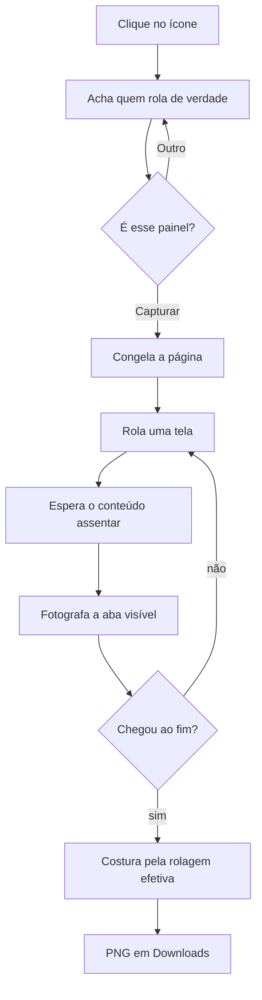

# Captura de Página Inteira

Extensão Chrome (Manifest V3, MIT) que fotografa a página inteira e entrega um PNG. Feita para as páginas em que as outras falham.

## Por que existe

Capturador de página inteira já existe e é grátis. Este resolve três casos que os outros erram:

1. **Painel interno.** Em Gmail, Notion, Slack e painéis administrativos, quem rola é um `div` dentro da página, não a janela. Esta extensão acha o painel certo, destaca ele na tela e pergunta antes de capturar.
2. **Cabeçalho fixo repetido.** O cabeçalho aparece uma vez, no topo. Barra de cookies, widget de chat e botão flutuante entram só no primeiro quadro e somem do resto.
3. **Carregamento preguiçoso.** A cada parada, a extensão espera as imagens carregarem e o conteúdo assentar. Lista virtualizada não deixa buraco, porque cada tela é fotografada de verdade em vez de reconstruída a partir do DOM.

## Instalar

```bash
git clone https://github.com/1marcelserrano/mscreative-plugins.git
```

Abra `chrome://extensions`, ligue o **Modo do desenvolvedor**, clique em **Carregar sem compactação** e aponte para `plugins/full-page-capture/`.

## Usar

Clique no ícone e depois em **Capturar página**. O painel que vai ser capturado acende em lima e a barra pergunta. `Enter` confirma, `Esc` cancela, **Outro** troca de alvo.

O arquivo cai em Downloads como `2026-08-13_notion-so_titulo-da-pagina.png`.

Enquanto captura, **não troque de aba** — o Chrome só fotografa a aba que está na frente, e a extensão aborta com aviso se você sair.

## Como funciona



A costura usa a rolagem que **de fato** aconteceu, não a que foi pedida. Página que trava no fim, que usa `scroll-snap` ou que anda menos que o pedido continua alinhada: o último quadro se sobrepõe ao anterior e cobre a sobra.

## Limites conhecidos

- **Conteúdo que é fixo.** Se o que você quer capturar é um pop-up aberto ou um leitor embutido em `position: fixed`, ele some a partir da segunda tela. A extensão trata elemento fixo como enfeite, não como conteúdo.
- **Rolagem infinita.** Para em 60 telas e avisa onde parou.
- **Página gigante.** Acima do limite de imagem do navegador, salva em resolução simples e avisa. Passando disso, corta — e diz que cortou.
- **Páginas do próprio Chrome.** `chrome://`, a Web Store e a página de extensões não aceitam injeção. Isso é regra do navegador.
- **Sem ícone próprio ainda.** O Chrome usa o ícone genérico até a arte entrar.

## Desenvolvimento

```bash
node --test "plugins/full-page-capture/test/**/*.test.mjs"
```

Os testes cobrem as três funções puras onde os erros passam despercebidos: o plano da costura, a pontuação dos candidatos a scroller e o nome do arquivo. As quatro páginas de `test/fixtures/` reproduzem os casos difíceis — painel interno, cabeçalho grudento, carregamento preguiçoso e página muito comprida.

**Arquitetura em uma frase:** o content script coleta e executa, o service worker decide e fotografa, o documento offscreen desenha e baixa.
